# Generate Fake Images on Google Street View House Number Using GAN Model

## Abstract

A Generative Adversarial Network (GAN) describes an architechture which is used for training generative models, such as generating images. In this notebook, I will use **Google Street View House Number (SVHN) dataset** to train GAN model.

## Technical Design

### Generative Adversarial Network

The GAN model contains two parts:
- **Generator**: The generator model will generate plausible images.
- **Discriminator**: The discriminator model will distinguish the real images and the fake images generated by the generator model.


The GAN model is designed based on **Zero-Sum Game** in **Game Theory**. Specifically, the goal of the generator model is to generate fake images as plausible as possible, so as to fraud the discriminator. Nevertheless, the goal of the discriminator model is to distinguish the fake images generated by the generator model. Eventually, both generator and discriminator will reach the **Nash Equilibrium** through dynamic game process.


### Class Diagram

In order to fulfill **Object-Oriented** software development methodology, each service class is created for the business logic.

Based on the **Single-Responsibility Principle**, each class shall be responsible for just one single piece of the program's functionality, such as loading images, generating real / fake images, creating generator / discriminator models, etc, which helps to reduce the hard-dependencies in the software logic.

Furthermore, we use **Factory Design Pattern** here to allow developers get access to each service class globally. We use **Dependency-Injection Principle** to register the service instances into the factory class, which allows developers to get the service instances through the pre-defined unique key. This helps to **de-couple** the software dependencies, and also makes it easier to perform software maintainence and conduct Unit Test.

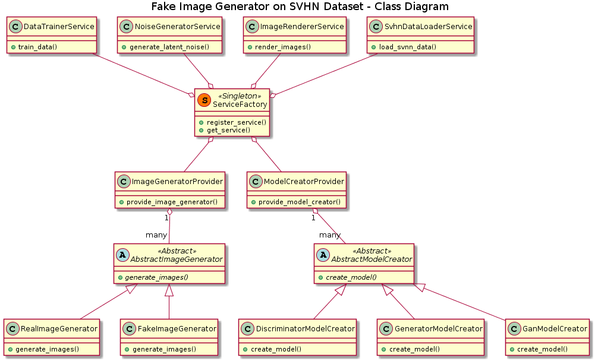

### Sequence Diagram

The training process on SVHN dataset involves several procedures. First and foremost, user will load the SVHN dataset, including both training dataset and test dataset. Specifically, the training dataset will be used to train the model, while the test dataset will be used to evaluate the performance. Then, the data trainer service will train both discriminator and generator. Finally, after several training epochs, we evaluate the performance of both discriminator and generator.

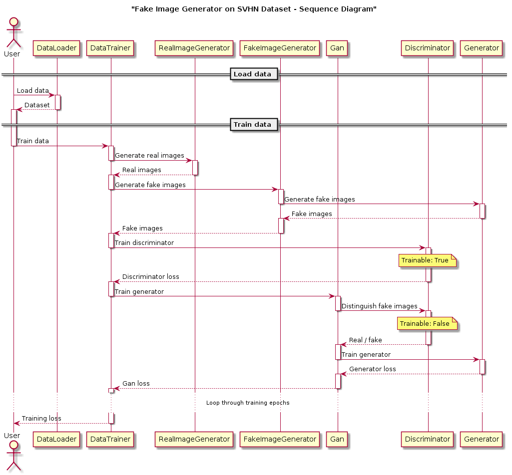

## Code Implementation

### Create Service Factory

First of all, the global constants are prepared for the data training process. One one hand, it reduces the redundant hard-coded variables in the logic. One the other hand, it makes it convenient for developers to adjust hyperparameters during data training process.


```python
"""Global Constants"""
# Hyperparameters
LATENT_DIMENSION = 100 # Size of the latent space
TRAINING_EPOCHS = 8000 # Number of epochs to train data

TRAIN_BATCH_SIZE = 256 # Train batch size
TEST_BATCH_SIZE = 32 # Test batch size

LEAKY_RELU_ALPHA = 0.2 # Leaky ReLU alpha
KERNEL_SIZE = 5 # Kernel size
STRIDES = 2 # Strides

LEARNING_RATE_DISCRIMINATOR = 0.001 # Learning rate
LEARNING_RATE_GAN = 0.0002 # Learning rate

BETA_1_DISCRIMINATOR = 0.5 # beta 1
BETA_1_GAN = 0.5 # beta 1

# Service class
SERVICE_CLASS_SVHN_DATA_LOADER = 'SERVICE_CLASS_SVHN_DATA_LOADER'
SERVICE_CLASS_IMAGE_RENDERER = 'SERVICE_CLASS_IMAGE_RENDERER'
SERVICE_CLASS_NOISE_GENERATOR = 'SERVICE_CLASS_NOISE_GENERATOR'
SERVICE_CLASS_IMAGE_GENERATOR_PROVIDER = 'SERVICE_CLASS_IMAGE_GENERATOR_PROVIDER'
SERVICE_CLASS_MODEL_CREATOR_PROVIDER = 'SERVICE_CLASS_MODEL_CREATOR_PROVIDER'
SERVICE_CLASS_DATA_TRAINER = 'SERVICE_CLASS_DATA_TRAINER'

# Image generator type
REAL_IMAGE_GENERATOR = 'REAL_IMAGE_GENERATOR'
FAKE_IMAGE_GENERATOR = 'FAKE_IMAGE_GENERATOR'

# Model creator type
DISCRIMINATOR_MODEL_CREATOR = 'DISCRIMINATOR_MODEL_CREATOR'
GENERATOR_MODEL_CREATOR = 'GENERATOR_MODEL_CREATOR'
GAN_MODEL_CREATOR = 'GAN_MODEL_CREATOR'
```

The service factory class is designed to allow developers to register and get service instances with a unique key. It is noteworthy that, the service factory is a **Singleton** class, so that the developers can globally get access to the service factory instance.


```python
class ServiceFactory(object):

    def __new__(self):
        """Singleton to allow global access to service factory"""
        if not hasattr(self, 'instance'):
            self.instance = super().__new__(self)
        return self.instance

    def __init__(self):
        """Initialize services dictionary"""
        self._services = {}

    def register_service(self, key, service):
        """Register service with key to the factory"""
        print('Register service: ', service, ' key: ', key)
        self._services[key] = service

    def get_service(self, key):
        """Get service with key from the factory"""
        service = self._services.get(key)
        print('Create service: ', service, ' key: ', key)
        if not service:
            raise ValueError(key)
        else:
            return service
```

Then, initialize the service factory instance to be used later.


```python
# Initialize service factory class
service_factory = ServiceFactory()
```

### Load Image Datasets

The data loader service class is created to load SVHN data. The SVHN data has been uploaded to the Google Drive under path "drive/My Drive/data/train_32x32.mat" and "drive/My Drive/data/rest_32x32.mat".


```python
from scipy.io import loadmat
from google.colab import drive

class SvhnDataLoaderService(object):

    def load_svnn_data(self, path):
        """Helper function to load SVHN data from path"""
        drive.mount('/content/drive')
        data = loadmat(path)
        return data['X'], data['y']
```

Then, initialize the data loader instance, and register it into service factory with a unique key.


```python
# Initialize SVHN data loader service class
svhn_data_loader_service = SvhnDataLoaderService()

# Register into service factory
service_factory.register_service(SERVICE_CLASS_SVHN_DATA_LOADER, svhn_data_loader_service)
```


After loading the SVHN data, we will transpose shape of the dataset from (width, height, channels, size) to (size, width, height, channels).

Considering that the generator is using **"tanh"** activation function, we need to pre-process the image data into the range between -1 and 1.


```python
# Load SVHN data
svhn_data_loader_service = service_factory.get_service(SERVICE_CLASS_SVHN_DATA_LOADER)
x_train, _ = svhn_data_loader_service.load_svnn_data('drive/My Drive/data/train_32x32.mat')
x_test, _ = svhn_data_loader_service.load_svnn_data('drive/My Drive/data/test_32x32.mat')

# Transpose the images (width, height, channels, size) -> (size, width, height, channels)
x_train = x_train.transpose((3, 0, 1, 2))
x_test = x_test.transpose((3, 0, 1, 2))

# The generator is using tanh activation
# Therefore we need to preprocess the image data into the range between -1 and 1
x_train = (x_train / 255.0) * 2 - 1
x_test = (x_test / 255.0) * 2 - 1

print('Train data: ', x_train.shape)
print('Test data: ', x_test.shape)
```

In order to show some of the images randomly, an image renderer class is created, which has a generic function to show images with rows and columns.


```python
from numpy import uint8
import matplotlib.pyplot as plt
%matplotlib inline

class ImageRendererService(object):
    
    def render_images(self, images, num_rows, num_cols):
        """Helper function to render / plot images"""
        fig, axes = plt.subplots(num_rows, num_cols)
        for i, ax in enumerate(axes.flat):
            img = images[i]
            img = uint8((img + 1) / 2 * 255)
            ax.imshow(img)
            ax.set_xticks([])
            ax.set_yticks([])
```

Then, initialize the image renderer instance, and register it into service factory with a unique key.


```python
# Initialize image renderer service class
image_renderer_service = ImageRendererService()

# Register into service factory
service_factory.register_service(SERVICE_CLASS_IMAGE_RENDERER, image_renderer_service)
```

Then, we will randomly show some of the images in the SVHN dataset.


```python
# Show some training images
image_renderer_service = service_factory.get_service(SERVICE_CLASS_IMAGE_RENDERER)
image_renderer_service.render_images(x_train, 4, 8)
```

### Generate Noise in Latent Space

The noise in latent space will become the input of the generator model. Therefore, the logic to generate noise will be encapsulated in the noise generator so as to be used in multiple places in the logic.


```python
class NoiseGeneratorService(object):

    def generate_latent_noise(self, batch_size):
        # Generate points in the latent space
        noise = randn(LATENT_DIMENSION * batch_size)
        # Reshape into a batch of inputs for the network
        noise = noise.reshape(batch_size, LATENT_DIMENSION)
        return noise
```

Then, initialize the noise generator instance, and register it into service factory with a unique key.


```python
# Initialize noise generator service class
noise_generator_service = NoiseGeneratorService()

# Register into service factory
service_factory.register_service(SERVICE_CLASS_NOISE_GENERATOR, noise_generator_service)
```

### Generate Real / Fake Images

We need to generate both real and fake images, so that discriminator model can learn to distinguish between real images and fake images.

Considering that there are two different ways to generate images (one is real, another is fake), we will use **Strategy Design Pattern** here to generate images.

We create an abstract class as the interface to generate images. The abstract image generator class is inherited by both real image generator and fake image generator.


```python
from abc import ABC, abstractmethod

class AbstractImageGenerator(ABC):

    @abstractmethod
    def generate_images(self):
        """Abstract method to generate images"""
        pass
```

The real image generator randomly selects images from the SVHN dataset.


```python
from numpy.random import randint
from numpy import ones

class RealImageGenerator(AbstractImageGenerator):

    def __init__(self, 
                 dataset, 
                 batch_size):
        self._dataset = dataset
        self._batch_size = batch_size

    def generate_images(self):
        """Generate real images"""
        # Randomly selected real images from dataset
        indexes = randint(0, self._dataset.shape[0], self._batch_size)
        selected_images = self._dataset[indexes]
        # Generate real images with labels 1
        labels = ones((self._batch_size, 1))
        return selected_images, labels
```

The fake image generator creates fake images generated by the generator model. Specifically, the generator model will receive the latent points as noise as input, and produces fake images as output.


```python
from numpy.random import randn
from numpy import zeros

class FakeImageGenerator(AbstractImageGenerator):

    def __init__(self,
                 noise_generator,
                 generator_model,
                 batch_size):
        self._noise_generator = noise_generator
        self._generator_model = generator_model
        self._batch_size = batch_size

    def generate_images(self):
        """Generate fake images"""
        # Generate fake images by generator model
        noise = self._noise_generator.generate_latent_noise(self._batch_size)
        fake_images = self._generator_model.predict(noise)
        # Generate fake images with labels 0
        labels = zeros((self._batch_size, 1))
        return fake_images, labels
```

Then, create image generator provider class to initialize the generator instances.


```python
class ImageGeneratorProvider(object):

    def provide_image_generator(self, 
                                generator_type, 
                                **kwargs):
        """Provide the image generator instance"""
        if generator_type == REAL_IMAGE_GENERATOR:
            # Initialize real image generator
            dataset = kwargs['dataset']
            batch_size = kwargs['batch_size']
            return RealImageGenerator(dataset, 
                                      batch_size)

        elif generator_type == FAKE_IMAGE_GENERATOR:
            # Initialize fake image generator
            noise_generator = kwargs['noise_generator']
            generator_model = kwargs['generator_model']
            batch_size = kwargs['batch_size']
            return FakeImageGenerator(noise_generator, 
                                      generator_model, 
                                      batch_size)
        else:
            raise ValueError('Invalid generator type')
```

Finally, initialize the image generator instance, and register it into service factory with a unique key.


```python
# Initialize image generator provider class
image_generator_provider = ImageGeneratorProvider()

# Register into service factory
service_factory.register_service(SERVICE_CLASS_IMAGE_GENERATOR_PROVIDER, image_generator_provider)
```

### Create Models

The core of GAN architecture depends on the discriminator model and generator model. Considering that we have to create several kinds of models, **Strategy Design Pattern** is also used here for a more rebust software architecture.


```python
from abc import ABC, abstractmethod

class AbstractModelCreator(ABC):

    @abstractmethod
    def create_model(self):
        """Abstract method to create model"""
        pass
```

The discriminator model is created to classify whether the input image is real or fake.

Furthermore, it is a convolutional neural network that takes a 32 x 32 image with 3 channels ("R", "G", and "B"). The activation of the output layer is *sigmoid* and the discriminator outputs a probability of the image being real.


```python
%tensorflow_version 2.x
import tensorflow as tf

from tensorflow.keras.models import Sequential
from tensorflow.keras.models import Model
from tensorflow.keras.optimizers import Adam
from tensorflow.keras.layers import Conv2D
from tensorflow.keras.layers import LeakyReLU
from tensorflow.keras.layers import Dropout
from tensorflow.keras.layers import Flatten
from tensorflow.keras.layers import Dense
from tensorflow.keras.layers import BatchNormalization
from tensorflow.keras.layers import Activation
from tensorflow.keras.layers import ZeroPadding2D
from tensorflow.keras.layers import Input

class DiscriminatorModelCreator(AbstractModelCreator):

    def create_model(self):
        """Create discriminator model"""
        model = Sequential()

        # 16 * 16 * 64
        model.add(Conv2D(64, 
                         kernel_size=KERNEL_SIZE, 
                         strides=STRIDES, 
                         input_shape=(32, 32, 3), 
                         padding="same"))
        model.add(LeakyReLU(alpha=LEAKY_RELU_ALPHA))

        # 8 * 8 * 128
        model.add(Conv2D(128, 
                         kernel_size=KERNEL_SIZE, 
                         strides=STRIDES, 
                         padding="same"))
        model.add(BatchNormalization())
        model.add(LeakyReLU(alpha=LEAKY_RELU_ALPHA))

        # 4 * 4 * 256
        model.add(Conv2D(256, 
                         kernel_size=KERNEL_SIZE, 
                         strides=STRIDES, 
                         padding="same"))
        model.add(BatchNormalization())
        model.add(LeakyReLU(alpha=LEAKY_RELU_ALPHA))
        
        # Output layer
        model.add(Flatten())
        model.add(Dense(1, activation='sigmoid'))

        optimizer = Adam(lr=LEARNING_RATE_DISCRIMINATOR, beta_1=BETA_1_DISCRIMINATOR)
        model.compile(loss='binary_crossentropy', 
                              optimizer=optimizer, 
                              metrics=['accuracy'])
        model.summary()

        return model
```

On the contrary, the generator model takes in 100 random numbers in the latent space as noise, and produces a 32 x 32 fake image.


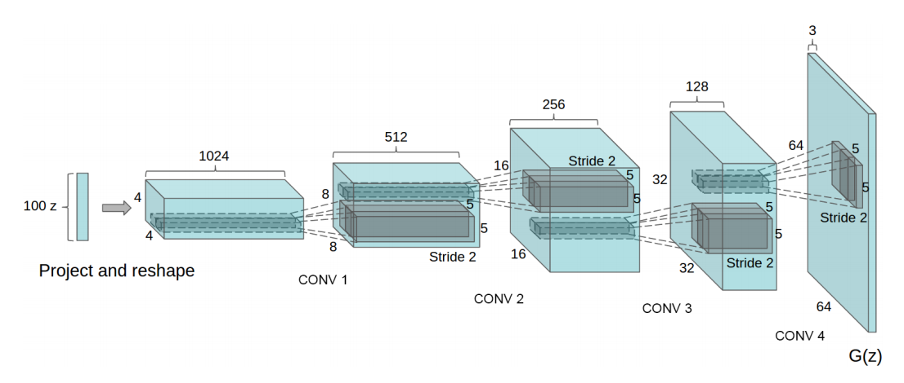

Based on the **DCGAN** model (Deep Convolutional Generative Adversarial Networks), the generator model reshapes each layer by doubling its width and height while cutting the filters into a half. Eventually, the last layer generates the 32 x 32 2D image with 3 channels.


```python
from tensorflow.keras.layers import Conv2DTranspose
from tensorflow.keras.layers import Reshape
from tensorflow.keras.layers import UpSampling2D
from tensorflow.keras.layers import Conv2D

class GeneratorModelCreator(AbstractModelCreator):

    def create_model(self):
        """Create generator model"""
        model = Sequential()

        # 4 * 4 * 512
        model.add(Dense(4 * 4 * 512, 
                        input_dim=LATENT_DIMENSION))
        model.add(Reshape((4, 4, 512)))
        model.add(BatchNormalization())
        model.add(LeakyReLU(alpha=LEAKY_RELU_ALPHA))

        # 8 * 8 * 256
        model.add(Conv2DTranspose(256, 
                                  kernel_size=KERNEL_SIZE, 
                                  strides=STRIDES, 
                                  padding='same'))
        model.add(BatchNormalization())
        model.add(LeakyReLU(alpha=LEAKY_RELU_ALPHA))

        # 16 * 16 * 128
        model.add(Conv2DTranspose(128, 
                                  kernel_size=KERNEL_SIZE, 
                                  strides=STRIDES, 
                                  padding='same'))
        model.add(BatchNormalization())
        model.add(LeakyReLU(alpha=LEAKY_RELU_ALPHA))

        # Output layer: 32 x 32 2D image with 3 channels
        model.add(Conv2DTranspose(3, 
                                  kernel_size=KERNEL_SIZE, 
                                  strides=STRIDES, 
                                  padding='same'))
        model.add(Activation('tanh'))
        model.summary()

        return model
```

The GAN model is a **logical model** which connects both generator and discriminator. It allows generator to receive latent points as input, and feed the generated fake images into discriminator. Once the discriminator receives the fake image, the classification results will be used to update the weights of the generator by using **Back Propagation Algorithm**.


```python
class GanModelCreator(AbstractModelCreator):

    def __init__(self, 
                 discriminator_model, 
                 generator_model):
        self._discriminator_model = discriminator_model
        self._generator_model = generator_model

    def create_model(self):
        """Create GAN model"""
        """A logical model to connect generator and discriminator"""
        # Connect generator model and discriminator model
        model = Sequential()
        model.add(self._generator_model)
        model.add(self._discriminator_model)

        optimizer = Adam(lr=LEARNING_RATE_GAN, beta_1=BETA_1_DISCRIMINATOR)
        model.compile(loss='binary_crossentropy', 
                      optimizer=optimizer)
        model.summary()
        
        return model
```

Then, create model creator provider class to initialize the model instances.


```python
class ModelCreatorProvider(object):

    def provide_model_creator(self, 
                              creator_type, 
                              **kwargs):
        """Provide the model creator instance"""
        if creator_type == DISCRIMINATOR_MODEL_CREATOR:
            return DiscriminatorModelCreator()

        elif creator_type == GENERATOR_MODEL_CREATOR:
            return GeneratorModelCreator()
        
        elif creator_type == GAN_MODEL_CREATOR:
            discriminator_model = kwargs['discriminator_model']
            generator_model = kwargs['generator_model']
            return GanModelCreator(discriminator_model, generator_model)
        
        else:
            raise ValueError('Invalid creator type')
```

Finally, initialize the model creator provider instance, and register it into service factory with a unique key.


```python
# Initialize model creator provider class
model_creator_provider = ModelCreatorProvider()

# Register into service factory
service_factory.register_service(SERVICE_CLASS_MODEL_CREATOR_PROVIDER, model_creator_provider)
```

### Train Data

Then, we need to train the SVHN dataset. The discriminator is trained first, and then the generator is trained via gan model. It is noteworthy that, we need to set discriminator as **not** trainable while training the generator.

Finally, we will evaluate the performance of both discriminator and generator, and display the loss in a diagram, which helps the developers to analyze the model and adjust the hyperparameters accordingly.


```python
import numpy as np
from numpy import vstack
from numpy import uint8
from matplotlib import pyplot as plt

class DataTrainerService(object):

    def train_data(self,
                   discriminator_model,
                   generator_model,
                   gan_model,
                   noise_generator,
                   real_train_image_generator,
                   fake_train_image_generator,
                   real_test_image_generator,
                   fake_test_image_generator,
                   train_dataset, 
                   test_dataset):
        """Train data"""
        losses = []
        for i in range(TRAINING_EPOCHS):

            # Train discriminator model
            real_train_images, real_train_labels = real_train_image_generator.generate_images()
            fake_train_images, fake_train_labels = fake_train_image_generator.generate_images()

            discriminator_model.trainable = True
            discriminator_model.train_on_batch(real_train_images, 
                                               real_train_labels)
            discriminator_model.train_on_batch(fake_train_images, 
                                               fake_train_labels)

            # Train generator model via gan model
            discriminator_model.trainable = False
            train_noise = noise_generator.generate_latent_noise(TRAIN_BATCH_SIZE)
            gan_model.train_on_batch(train_noise, 
                                     real_train_labels)

            # Evaluate performance
            if i % 50 == 0:

                real_test_images, real_test_labels = real_test_image_generator.generate_images()
                fake_test_images, fake_test_labels = fake_test_image_generator.generate_images()

                real_discriminator_loss, _ = discriminator_model.test_on_batch(real_test_images, 
                                                                               real_test_labels)
                fake_discriminator_loss, _ = discriminator_model.test_on_batch(fake_test_images, 
                                                                               fake_test_labels)
                discriminator_loss = real_discriminator_loss + fake_discriminator_loss
                
                test_noise = noise_generator.generate_latent_noise(TEST_BATCH_SIZE)
                gan_loss = gan_model.test_on_batch(test_noise,
                                                   real_test_labels)
                
                losses.append((discriminator_loss, gan_loss))

                print("Epoch: %d/%d Discriminator Loss: %.3f Generator Loss: %.3f" % (i + 1, TRAINING_EPOCHS, discriminator_loss, gan_loss))

            # Save plot
            if (i + 1) % 500 == 0:
                for k in range(4 * 8):
                    img = fake_test_images[k]
                    img = uint8((img + 1) / 2 * 255)
                    plt.subplot(4, 8, k + 1)
                    plt.axis('off')
                    plt.imshow(img)
                plt.tight_layout()
                plt.show()
        
        # Show loss
        losses = np.array(losses)
        fig, ax = plt.subplots()
        plt.plot(losses.T[0], label='Discriminator')
        plt.plot(losses.T[1], label='Generator')
        plt.title("Validation Losses")
        plt.legend()
        plt.show()
```

After creating the data trainer, we need to initialize the instance, and register it into service factory with a unique key.


```python
# Initialize data trainer service class
data_trainer_service = DataTrainerService()

# Register into service factory
service_factory.register_service(SERVICE_CLASS_DATA_TRAINER, data_trainer_service)
```

Finally, we wrap up all the preparations and start the training process.


```python
# Get model instance
model_creator_provider = service_factory.get_service(SERVICE_CLASS_MODEL_CREATOR_PROVIDER)

discriminator_model_creator = model_creator_provider.provide_model_creator(DISCRIMINATOR_MODEL_CREATOR)
discriminator_model = discriminator_model_creator.create_model()

generator_model_creator = model_creator_provider.provide_model_creator(GENERATOR_MODEL_CREATOR)
generator_model = generator_model_creator.create_model()

gan_model_creator = model_creator_provider.provide_model_creator(GAN_MODEL_CREATOR, 
                                                                 discriminator_model=discriminator_model,
                                                                 generator_model=generator_model)
gan_model = gan_model_creator.create_model()

# Get image generator
noise_generator = service_factory.get_service(SERVICE_CLASS_NOISE_GENERATOR)
image_generator_provider = service_factory.get_service(SERVICE_CLASS_IMAGE_GENERATOR_PROVIDER)

real_train_image_generator = image_generator_provider.provide_image_generator(REAL_IMAGE_GENERATOR, 
                                                                              dataset=x_train, # Train dataset
                                                                              batch_size=TRAIN_BATCH_SIZE)
fake_train_image_generator = image_generator_provider.provide_image_generator(FAKE_IMAGE_GENERATOR,
                                                                              noise_generator=noise_generator,
                                                                              generator_model=generator_model, 
                                                                              batch_size=TRAIN_BATCH_SIZE)
        
real_test_image_generator = image_generator_provider.provide_image_generator(REAL_IMAGE_GENERATOR, 
                                                                             dataset=x_test, # Test dataset
                                                                             batch_size=TEST_BATCH_SIZE)
fake_test_image_generator = image_generator_provider.provide_image_generator(FAKE_IMAGE_GENERATOR,
                                                                             noise_generator=noise_generator,
                                                                             generator_model=generator_model,
                                                                             batch_size=TEST_BATCH_SIZE)

# Start data training
data_trainer_service = service_factory.get_service(SERVICE_CLASS_DATA_TRAINER)
data_trainer_service.train_data(discriminator_model, 
                                generator_model, 
                                gan_model,
                                noise_generator,
                                real_train_image_generator,
                                fake_train_image_generator,
                                real_test_image_generator,
                                fake_test_image_generator,
                                x_train, 
                                x_test)
```

## Findings

I have adjusted the hyperparameters several times to train the model, in order to find the best result. The findings are as follows.

### Trial 1

**Hyperparameters:**

```python
LATENT_DIMENSION = 100 # Size of the latent space
TRAINING_EPOCHS = 8000 # Number of epochs to train data

TRAIN_BATCH_SIZE = 256 # Train batch size
TEST_BATCH_SIZE = 32 # Test batch size

LEAKY_RELU_ALPHA = 0.2 # Leaky ReLU alpha
KERNEL_SIZE = 5 # Kernel size
STRIDES = 2 # Strides

LEARNING_RATE_DISCRIMINATOR = 0.0002 # Learning rate
LEARNING_RATE_GAN = 0.0002 # Learning rate

BETA_1_DISCRIMINATOR = 0.6 # beta 1
BETA_1_GAN = 0.6 # beta 1
```

**Generated images:**

&nbsp;&nbsp;&nbsp;Epoch 500<br/>
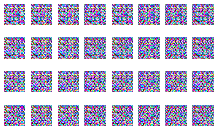

&nbsp;&nbsp;&nbsp;Epoch 4000<br/>
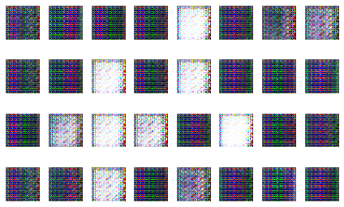

&nbsp;&nbsp;&nbsp;Epoch 8000<br/>
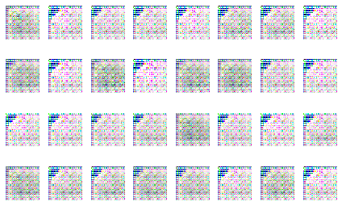

**Loss diagram:**

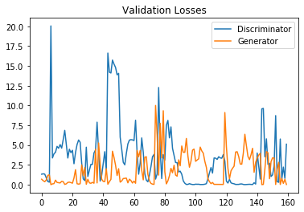

**Observations:**

- Only **garbage images** are generated.
- The discriminator loss and generator loss are extremely **unstable**.

### Trial 2

In the second round of trial, I adjusted the hyperparameters a little bit by **increasing the discriminator learning rate**. Besides, I reduced the learning rate of generater a little bit. This allows the discriminator model to quickly learn how to distinguish plausible images, so that to provide feedback to the generator model to adjust weights.

**Hyperparameters:**

```python
LATENT_DIMENSION = 100 # Size of the latent space
TRAINING_EPOCHS = 8000 # Number of epochs to train data

TRAIN_BATCH_SIZE = 256 # Train batch size
TEST_BATCH_SIZE = 32 # Test batch size

LEAKY_RELU_ALPHA = 0.2 # Leaky ReLU alpha
KERNEL_SIZE = 5 # Kernel size
STRIDES = 2 # Strides

LEARNING_RATE_DISCRIMINATOR = 0.001 # Learning rate
LEARNING_RATE_GAN = 0.0001 # Learning rate

BETA_1_DISCRIMINATOR = 0.5 # beta 1
BETA_1_GAN = 0.5 # beta 1
```

**Generated images:**

&nbsp;&nbsp;&nbsp;Epoch 500<br/>
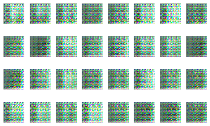

&nbsp;&nbsp;&nbsp;Epoch 4000<br/>
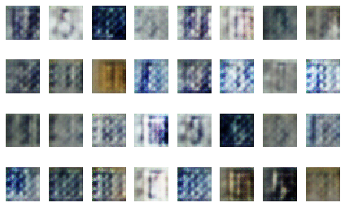

&nbsp;&nbsp;&nbsp;Epoch 8000<br/>
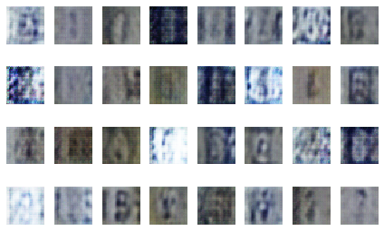

**Loss diagram:**

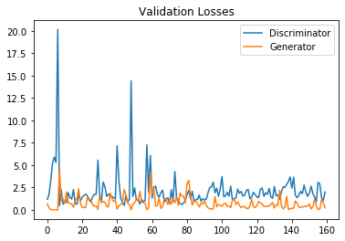

**Observations:**

- The generated fake images has the rough pattern and color with the real images, which is **better than Trial 1**
- However, the exact figure of generated images are **still very blur**, and have much difference with the real images
- The discriminator loss and generator loss are better than Trial 1, but **still not stable enough**, after several epochs of training process

### Trial 3

In the third round of trial, I tried to **increase the learning rate of the generator model**, so that it can learn to generate fake images quickly. **The result is much better than Trial 1 and Trial 2.** After only 2000 epochs of training process, the plausible images can be generated successfully.

**Hyperparameters:**

```python
LATENT_DIMENSION = 100 # Size of the latent space
TRAINING_EPOCHS = 8000 # Number of epochs to train data

TRAIN_BATCH_SIZE = 256 # Train batch size
TEST_BATCH_SIZE = 32 # Test batch size

LEAKY_RELU_ALPHA = 0.2 # Leaky ReLU alpha
KERNEL_SIZE = 5 # Kernel size
STRIDES = 2 # Strides

LEARNING_RATE_DISCRIMINATOR = 0.001 # Learning rate
LEARNING_RATE_GAN = 0.0002 # Learning rate

BETA_1_DISCRIMINATOR = 0.5 # beta 1
BETA_1_GAN = 0.5 # beta 1
```

**Generated images:**

&nbsp;&nbsp;&nbsp;Epoch 500<br/>
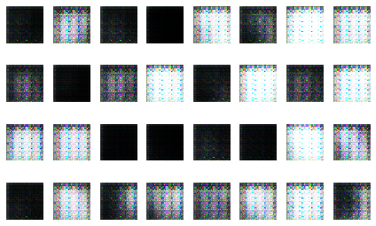

&nbsp;&nbsp;&nbsp;Epoch 2000<br/>
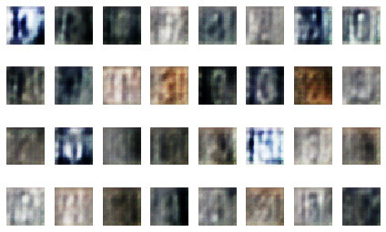

&nbsp;&nbsp;&nbsp;Epoch 4000<br/>
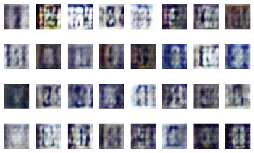

&nbsp;&nbsp;&nbsp;Epoch 6000<br/>
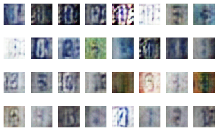

&nbsp;&nbsp;&nbsp;Epoch 8000<br/>


**Loss diagram:**

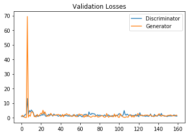

**Observations:**

- The generated images are plausible enough
- The generator model can generate the plausible images quickly. After only 2000 epochs of training process, we can see the generated images are plausible enough
- The discriminator and generator loss become **stable** after several epochs of training process

If we compare with the real images, the fake images generated by GAN model is quite plausible.

&nbsp;&nbsp;&nbsp;Real images<br/>
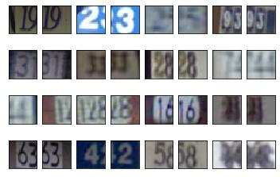

&nbsp;&nbsp;&nbsp;Fake images<br/>


## Final Model Download

For the purpose of future re-use the model, I have saved the trained model with fine-tuned hyperparameters. Developers may download the model with the following link:


```python
generator_model.save('generator_model.h5')
```

[generator_model.h5](./generator_model.h5)

## Conclusion

To put it in a nutshell, this notebook demonstrates the model design and training process to generate fake Google Street View House Number images using GAN model.

## Reference

- [How to Develop a GAN for Generating MNIST Handwritten Digits](https://machinelearningmastery.com/how-to-develop-a-generative-adversarial-network-for-an-mnist-handwritten-digits-from-scratch-in-keras/)
- [Overview of GAN Structure](https://developers.google.com/machine-learning/gan/gan_structure)
- [Deep Convolutional GAN (DCGAN) with SVHN](https://github.com/naokishibuya/deep-learning/blob/master/python/dcgan_svhn.ipynb)
- [Building a Generative Adversarial Network using Keras](https://www.geeksforgeeks.org/building-a-generative-adversarial-network-using-keras/)
- [SVHN Dataset](https://github.com/aditya9211/SVHN-CNN/blob/master/data_preprocess.ipynb)
